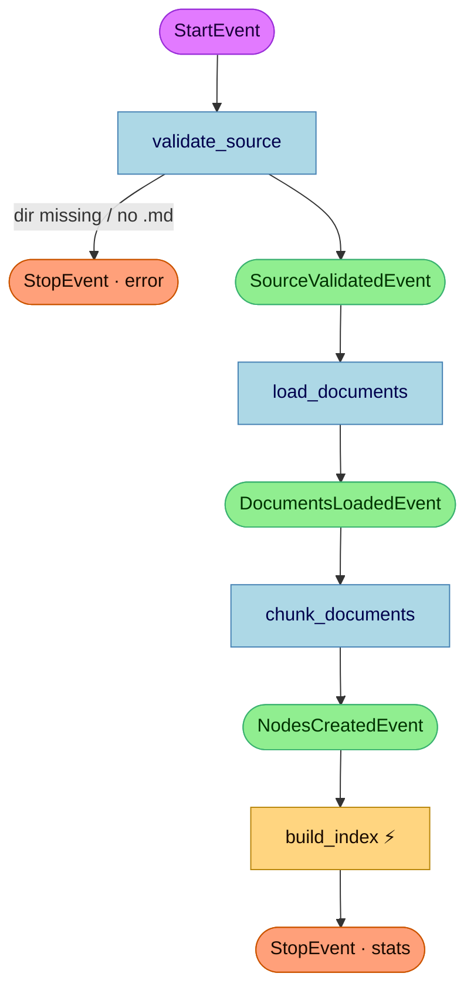
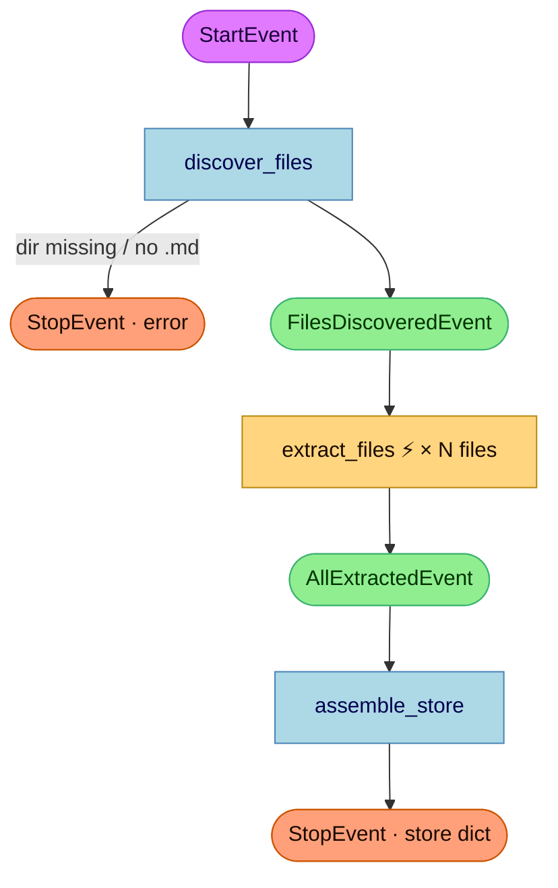
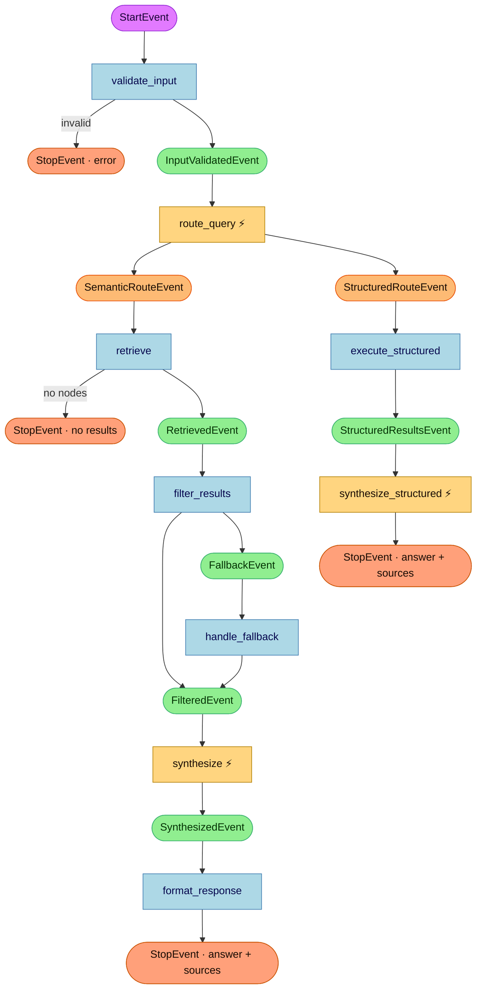
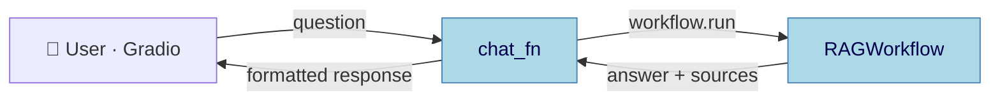
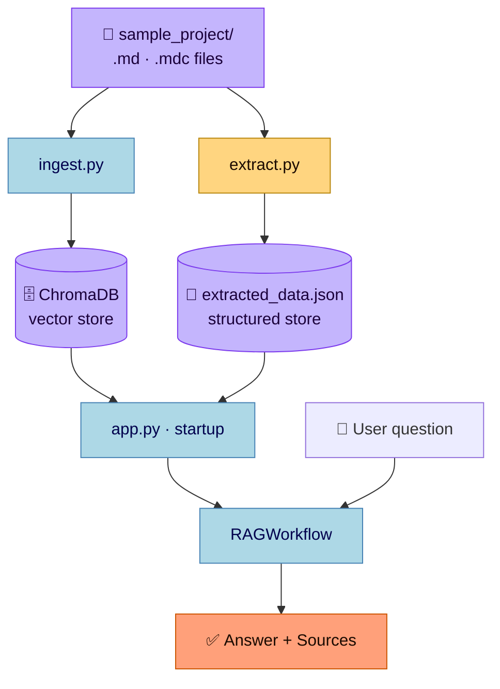

# RAG Query Workflow

> **Open [`workflow_graph.html`](workflow_graph.html) in a browser** for the full interactive version.

<script src="https://cdnjs.cloudflare.com/ajax/libs/vis-network/9.1.2/dist/vis-network.min.js" crossorigin="anonymous"></script>
<style>
#rag-graph {
  width: 100%; height: 600px;
  border: 1px solid #d1d5db;
  border-radius: 8px;
  background: radial-gradient(ellipse at 50% 40%, #f8fbff 0%, #edf2f7 100%);
}
</style>
<div id="rag-graph"></div>
<script>
(function(){
  if(typeof vis === 'undefined') return;
  var nodes = new vis.DataSet([
    {id:'StartEvent',          label:'StartEvent',          shape:'ellipse', color:{background:'#E27AFF',border:'#9b30d9'}, font:{color:'#2d0040',size:13}},
    {id:'validate_input',      label:'validate_input',      shape:'box',     color:{background:'#ADD8E6',border:'#4682b4'}, font:{color:'#00004d',size:13}},
    {id:'InputValidatedEvent', label:'InputValidatedEvent', shape:'ellipse', color:{background:'#90EE90',border:'#3a9e3a'}, font:{color:'#003300',size:13}},
    {id:'retrieve',            label:'retrieve',            shape:'box',     color:{background:'#ADD8E6',border:'#4682b4'}, font:{color:'#00004d',size:13}},
    {id:'RetrievedEvent',      label:'RetrievedEvent',      shape:'ellipse', color:{background:'#90EE90',border:'#3a9e3a'}, font:{color:'#003300',size:13}},
    {id:'filter_results',      label:'filter_results',      shape:'box',     color:{background:'#ADD8E6',border:'#4682b4'}, font:{color:'#00004d',size:13}},
    {id:'FilteredEvent',       label:'FilteredEvent',       shape:'ellipse', color:{background:'#90EE90',border:'#3a9e3a'}, font:{color:'#003300',size:13}},
    {id:'FallbackEvent',       label:'FallbackEvent',       shape:'ellipse', color:{background:'#90EE90',border:'#3a9e3a'}, font:{color:'#003300',size:13}},
    {id:'handle_fallback',     label:'handle_fallback',     shape:'box',     color:{background:'#ADD8E6',border:'#4682b4'}, font:{color:'#00004d',size:13}},
    {id:'synthesize',          label:'synthesize',          shape:'box',     color:{background:'#ADD8E6',border:'#4682b4'}, font:{color:'#00004d',size:13}},
    {id:'SynthesizedEvent',    label:'SynthesizedEvent',    shape:'ellipse', color:{background:'#90EE90',border:'#3a9e3a'}, font:{color:'#003300',size:13}},
    {id:'format_response',     label:'format_response',     shape:'box',     color:{background:'#ADD8E6',border:'#4682b4'}, font:{color:'#00004d',size:13}},
    {id:'StopEvent',           label:'StopEvent',           shape:'ellipse', color:{background:'#FFA07A',border:'#cc5500'}, font:{color:'#2d1000',size:13}},
  ]);
  var edges = new vis.DataSet([
    {from:'StartEvent',          to:'validate_input',      arrows:'to'},
    {from:'validate_input',      to:'InputValidatedEvent', arrows:'to'},
    {from:'validate_input',      to:'StopEvent',           arrows:'to'},
    {from:'InputValidatedEvent', to:'retrieve',            arrows:'to'},
    {from:'retrieve',            to:'RetrievedEvent',      arrows:'to'},
    {from:'retrieve',            to:'StopEvent',           arrows:'to'},
    {from:'RetrievedEvent',      to:'filter_results',      arrows:'to'},
    {from:'filter_results',      to:'FilteredEvent',       arrows:'to'},
    {from:'filter_results',      to:'FallbackEvent',       arrows:'to'},
    {from:'FallbackEvent',       to:'handle_fallback',     arrows:'to'},
    {from:'handle_fallback',     to:'FilteredEvent',       arrows:'to'},
    {from:'FilteredEvent',       to:'synthesize',          arrows:'to'},
    {from:'synthesize',          to:'SynthesizedEvent',    arrows:'to'},
    {from:'SynthesizedEvent',    to:'format_response',     arrows:'to'},
    {from:'format_response',     to:'StopEvent',           arrows:'to'},
  ]);
  new vis.Network(document.getElementById('rag-graph'), {nodes:nodes, edges:edges}, {
    edges:  {color:{color:'#5aada8'}, smooth:{type:'dynamic'}, width:1.5},
    physics:{solver:'forceAtlas2Based', stabilization:{iterations:300,fit:true}},
    interaction:{hover:true, dragNodes:true}
  });
})();
</script>


---

## 1 · Ingestion Pipeline — `ingest.py`

Runs **once** to embed all documentation files into ChromaDB.

```
python ingest.py
```



| Step | LLM | Description |
|------|-----|-------------|
| `validate_source` | — | Checks directory exists and contains `.md`/`.mdc` files |
| `load_documents` | — | Reads files from disk; attaches tool/filename/type metadata |
| `chunk_documents` | — | Splits files into nodes via `MarkdownNodeParser` |
| `build_index` | **Cohere Embed** | Vectorises nodes and writes to ChromaDB |

---

## 2 · Structured Extraction Pipeline — `extract.py`

Runs **once** to extract typed knowledge items into a JSON store.

```
python extract.py
```



| Extracted type | Description |
|----------------|-------------|
| `decisions` | Technical / architectural decisions |
| `rules` | Guidelines and constraints to follow |
| `warnings` | Sensitive areas and high-risk operations |
| `dependencies` | External libraries, services, APIs |
| `changes` | Recent updates, migrations, refactors |

---

## 3 · Query Pipeline — `workflow.py`

Handles every user question with automatic routing between two retrieval paths.



### Router Decision

| Route | When to use |
|-------|-------------|
| `semantic` | Explanations, how-to, architecture, configuration, conceptual questions |
| `structured` | "List all...", "latest rule on...", "what changed recently?" |

| `query_type` | Store call |
|---|---|
| `all_type` | `store.get_all(item_type)` |
| `recent` | `store.get_recent(days=N)` |
| `tags` | `store.get_by_tags([...])` |
| `text_search` | `store.search_text(keyword)` |

> **Fallback:** if the structured store is unavailable or the router LLM fails, the system automatically uses the semantic path.

### Step Summary

| Step | LLM | Consumes | Emits |
|------|-----|----------|-------|
| `validate_input` | — | `StartEvent` | `InputValidatedEvent` · `StopEvent` |
| `route_query` | **Cohere** | `InputValidatedEvent` | `SemanticRouteEvent` · `StructuredRouteEvent` |
| `retrieve` | — | `SemanticRouteEvent` | `RetrievedEvent` · `StopEvent` |
| `filter_results` | — | `RetrievedEvent` | `FilteredEvent` · `FallbackEvent` |
| `handle_fallback` | — | `FallbackEvent` | `FilteredEvent` |
| `synthesize` | **Cohere** | `FilteredEvent` | `SynthesizedEvent` |
| `format_response` | — | `SynthesizedEvent` | `StopEvent` |
| `execute_structured` | — | `StructuredRouteEvent` | `StructuredResultsEvent` |
| `synthesize_structured` | **Cohere** | `StructuredResultsEvent` | `StopEvent` |

---

## 4 · Application Layer — `app.py`

```
python app.py  →  http://localhost:7860
```



**Startup sequence:**
1. Load `CohereEmbedding` + `Cohere LLM`
2. Open ChromaDB persistent collection → `VectorStoreIndex`
3. Load `StructuredStore` from `extracted_data.json`
4. Instantiate `RAGWorkflow` with all components
5. Launch Gradio on `0.0.0.0:7860`

---

## 5 · End-to-End Data Flow



---

## 6 · Run Order

```powershell
# Step 1 — build the vector index  (run once, or when docs change)
python ingest.py

# Step 2 — build the structured JSON store  (run once, or when docs change)
python extract.py

# Step 3 — start the chat application
python app.py
```

> Steps 1 and 2 are independent and can run in either order.  
> Step 3 requires the ChromaDB index (Step 1) and benefits from the JSON store (Step 2).

---

## 7 · File Map

| File | Role |
|------|------|
| `ingest.py` | Ingestion workflow — embed docs into ChromaDB |
| `extract.py` | Extraction workflow — build structured JSON store |
| `workflow.py` | RAG query workflow — validate → route → retrieve → synthesize |
| `structured_store.py` | In-memory query interface over `extracted_data.json` |
| `app.py` | Gradio chat UI + startup initialisation |
| `config.py` | Central configuration (API keys, paths, model names, thresholds) |
| `chroma_db/` | Persistent ChromaDB vector store |
| `extracted_data.json` | Structured knowledge store (generated by `extract.py`) |
| `sample_project/` | Source documentation (Cursor + Claude Code) |
